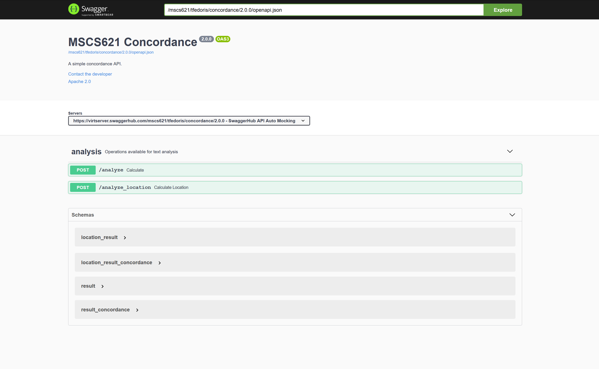

# MSCS 621 - Concordance
> A simple concordance API developed using Python-Flask server stub code generated by Swagger-UI.

## Table of contents
* [General info](#general-info)
* [Screenshots](#screenshots)
* [Requirements](#requirements)
* [Setup and Usage](#setup-and-usage)
* [Features](#features)
* [Status](#status)

## General Info
This project will be developed over time as more assignments are completed for the MSCS 621 - Cloud Computing course. It is of a simple API that generates concordance based on a given input string and is hosted on Amazon Web Service EC2.

## Screenshots


## Requirements
Python 3.5.2+

## Setup and Usage
To run the server via Tornado HTTP, please execute the following from the root directory:

```
pip3 install -r requirements.txt
python3 -m swagger_server
```

Or to run the server using Flask with uWSGI, please execute the following instead:
```
pip3 install -r requirements.txt
uwsgi --ini uwsgi.ini
```

and open your browser to here:

```
http://localhost:8080/mscs621/tfedoris/concordance/2.0.0/ui/
```

Your Swagger definition lives here:

```
http://localhost:8080/mscs621/tfedoris/concordance/2.0.0/swagger.json
```

To launch the integration tests, use tox:
```
sudo pip install tox
tox
```

## Features
* Generate concordance containing a breakdown of the words in a given input and their frequency
    * Case-Insensitive and ignores all punctuation except for hyphens (-) and apostrophies (')
* Generate concordance containing a breakdown of the words in a given input and the location in which they each appeared in the original input
    * Case-Insensitive and ignores all punctuation except for hyphens (-) and apostrophies (')
* Can be run remotely via connection to AWS EC2 instance.
* Can store the results of the text analysis in a DynamoDB on the AWS EC2 instance so the calculation only needs to be performed once
* Can run asynchronously, utilizing either Tornado as the HTTP server or by using Flask with uWSGI
* Can be deployed via AWS Elastic Beanstalk

## Status
Project is: _in progress_

## Credits
Project by Tyler Fedoris